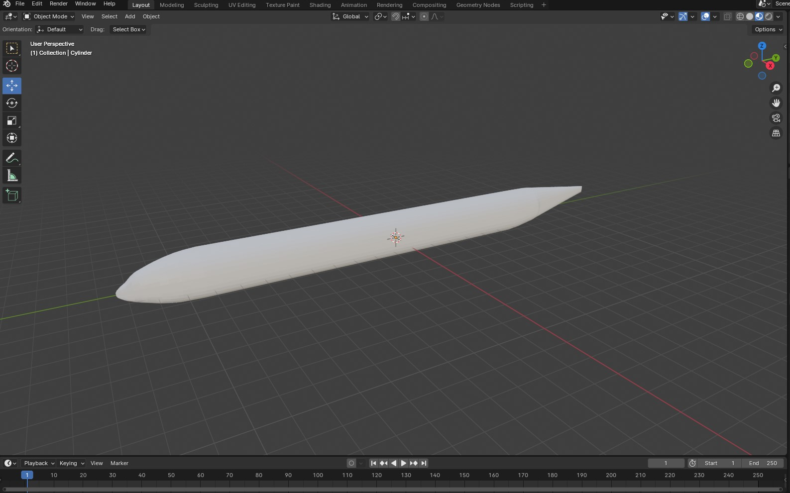

# Entry 1
##### 11/03/2024

## Content
This is it. It is The final year of high school and it has been an amazing journey to go through. For my Year-long project, I decided to 3D model the very popular  777-300ER using the 3D software [Blender](https://www.blender.org/). I decided to use it because Most people in the flight sim community use it to make planes for [Microsoft flight simulator](https://www.flightsimulator.com/), [X-Plane 12](https://www.x-plane.com/), and [P3D](https://www.prepar3d.com/). These are not just games, these are used to enhance your training to become a pilot, or to enjoy your free time after school or work. This is why 3D developers make planes that are for money. They code the virtual plane to fly almost like the real one. For example [PMDG](https://pmdg.com/) has made the Boeing 737 family and is currently making the Boeing 777 family. They have inspired me to make my plane. I wanted to prove that It does not take a 20-man team to make one plane. So I'm going to make my 777-300ER. So far I have made the general body of the plane:

## Sources

For this I will be using a lot of tutorials because I don't know how to make a plane from scratch. The person I will watch is [Brady Margeson](https://www.youtube.com/@BradyMargeson), He has amazing videos with Blender and also has a lot of views, this shows me that he is good at what he does. He will show me the fundamentals of making the plane and how to make the engines, wings, and tail. It looks like I will be learning how to make the 3D cockpit and also how to make the landing gear and texture.

## Engineering Design Process (EDP)

 Currently, we are in the first step in the EDP which is defining the problem. The problem we are facing here is whether it takes 20-35 people to make a single 3D model of an airplane. I don't think so. This is the problem I am trying to solve as a one-man mission.

 ## Skills

The skill I learned during this is how to google. I have found many people doing the same thing as me but they are not as good as I wanted them to be so finding the right person to use as a reference must be someone that knows what he is doing.

[Next](entry02.md)

[Home](../README.md)