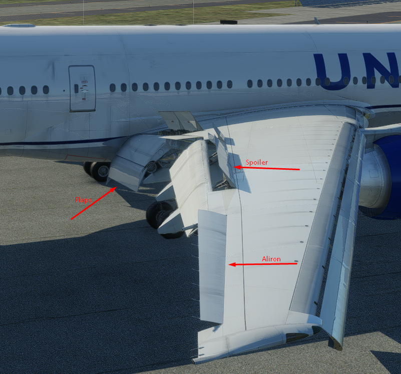

# Entry 2
##### 12/14/2024

## Content
I have made great Progress so far into this project and will continue to make progress as this project. So far I have learned to use the mirror finction that blender has rather than modoling the same thing two times. And I have Compleated the general shape of the wings:

I know that their is still some work to do but this is a great start as everyone starts some where. And I will also model the Alirons, Spoilers ,slats,and the flaps.

The picture you see Above is a Picture of a 777-200ER. This plane is made by a company called [Flight Factor](https://flightfactor.aero/). They make the most realistic Airplanes for [X-Plane 12](https://www.x-plane.com). As For me I cant compete with a team of 20 people So I will Try and make the best of what I can do with what I have and the resources that I have. For this winter break I will most likly finish the Elevators of the plane and also the animations for it as it is mostly the simplist thing to animate. I will also start with the Flap and Spoiler modoling.

## Engineering Design Process (EDP)
Currently, we are in the Second step in the EDP which is researching the problem. The problem we are facing here is whether it takes 20-35 people to make a single 3D model of an airplane. I have been reaserching on differant ways to make my model as good as the paid one's so I will have to make lots of edites and tweks befor I have the final product.

## Skills

The skill I learned during this is Attention to detail. I am making a highly detailed plane and having a low quality product is not acceptable given that we are having one year to compleate this project.

[Previous](entry01.md) | [Next](entry03.md)

[Home](../README.md)