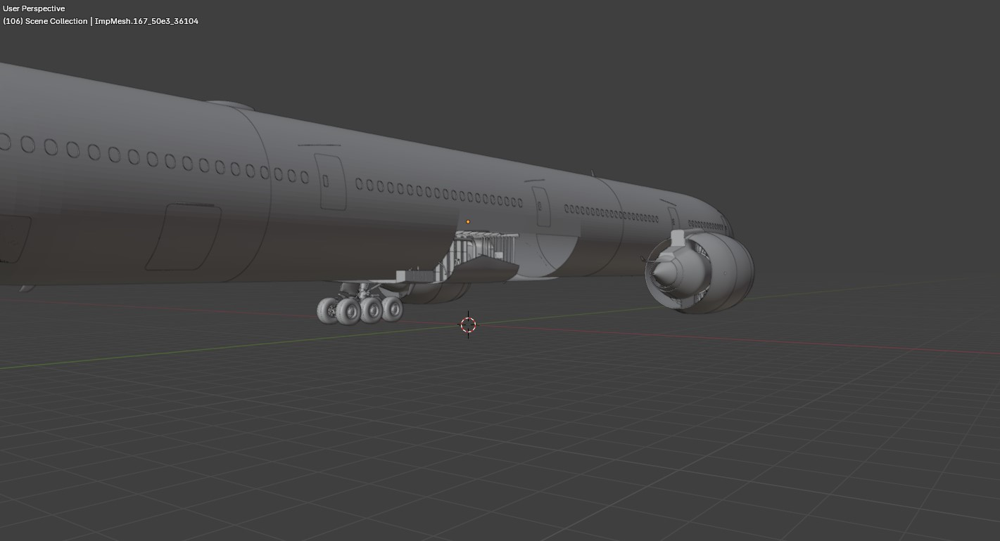

# Entry 3
##### 2/23/2025

## Content

Over the past two months, I have made great progress with my 3D modeling and I am done with everything but I had one problem with my project after one incident. I recently updated Blender and it has completely messed up everything. Half of my plane is completely gone

I got nervous because I worked hard to do this and then I thought to myself I can just delete the right engine and the right tip of the wing and just mirror whatever was on the left to the right and it surprisingly worked I thought I would get an error by doing this. So with that and everything fixed I added everything material and then added the [Xplane2blender](https://github.com/X-Plane/XPlane2Blender) addon. After I added everything all the objects to Xplane Maker. I made everything visible and then...

I tried to do everything I could to fix this. I tried to delete and reinstall the addon I tried to change the material and I had no luck with this. I looked online but since people(3rd party companies) don't like to share their methods goo was no help. As a final hope to get this working again, I asked people from the New York Air Route Traffic Control Center (NYARTCC). It is an organization where people provide ATC to people all over the world virtually. I posted that message asking for help and 10 minutes later someone asked if I could get on a call and sort the issue out. The face of the object was flipped inside out. So Red means that it is on the inside and blue means it is on the outside.

And with this, I turned everything into blue and Fixed the issue. I exported it and added all the new objects into *plane maker" and it was finally fixed.

The next step is to make a general shape of the plane because X-Plane needs to know what the shape of the plane is. I wish that I could do it automatically but I have to do it manually. So that is the next step. After that, it is off to Animation and Finally adding textures because having a gray plane like this would be ugly so those are the next steps in completing this project.

### Skills

The skill I learned during this is a Growth mindset. I am making a highly detailed plane and having a low-quality plane and also that is missing things is not good given the fact that it is very dear to me and that I am very patient about this project. Asking for help saved me a lot of time and effort. I was also afraid that someone would not know what Im facing.

[Previous](entry02.md) | [Next](entry04.md)

[Home](../README.md)