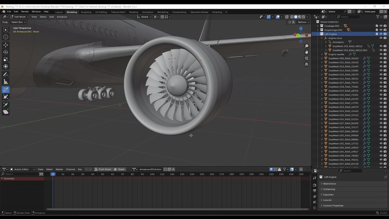
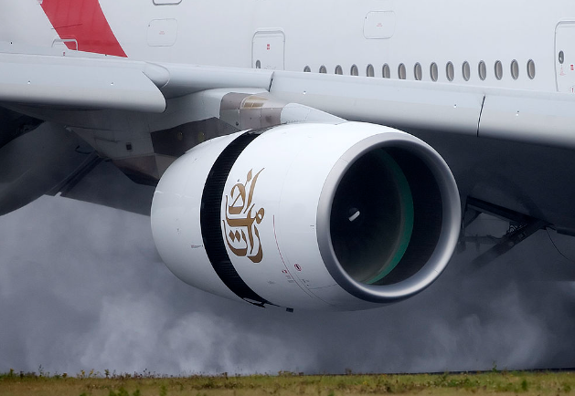
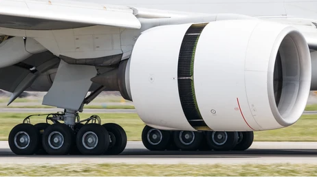
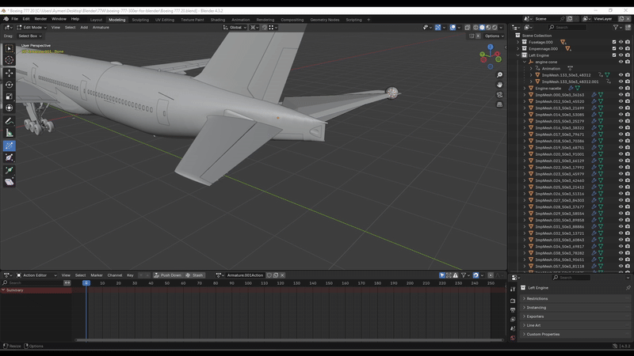

# Entry 4
##### 3/31/2025

### Content

I have made some significant progress in the animation. I have animated the Fan blads and also the reverse thrust of the aircraft. I have also Animated the Elevators, The elevators control the pitch (Angle of the nose) of the plane on take-off and landing.

Above you can see the engine fan blad is spinning. To do this it was a lot simpler than what I had to do it. The simple way was to click on the fan blades apply to their rotation and then set the angle to 0° and also add a keyframe and set it to Frame #0. I then chose the next frame which was 60. I then set the angle to 500° just so it spins fast, so in 1 second, the fan blades will spin 500°. In the background, you can see something slide out. That is the reverse thrust you can see on most modern commercial planes.

In the second gif we can see the elevators that are primary flight control surfaces that control the aircraft's movement about the lateral axis, also known as pitch, allowing pilots to raise or lower the nose of the plane. The animation for the elevators where the worst thing that has ever happened to me in my life. I spent 6 real-life hours on one thing trying to animate it but still does not work because it looks like the elevator was broken and only moving on one pivot point. I tried to do multiple things. I tried to pair it to a sphere and rotate the sphere so when ever the sphere rotates the elevator will also rotate. That did not work as it still looked like it was still broken. I tried to do the same thing with an `empty` this is a space that serves as a visual reference or handles for various purposes, like parenting objects, targeting constraints, or controlling modifiers. So I tried to pair the empty to the elevator and it paired but did not want to animate. I got really frustrated and so called upon a friend of mine who works with blender and also works for `X-Plane`. He advised me to use a `bone`. It is what you see on the right elevator. A `Bone` is an element of an armature, which is used for rigging and animating. So I pined the tip of the bone to one pivot point of the elevator and the tail to the over pivot point and made it rotate and lo and behold it worked without any problems.

### [Engineering Design Process](https://hstatsep.github.io/students/#edp:~:text=most%20promising%20solution-,Create%20a%20prototype,-Test%20and%20evaluate)

Currently, I am in the 5th step of the EDP which is  `Create a prototype` As I am still animating, I am still going to animate the flaps and the slats and spoilers and also the landing gear.

### Skills

The skills I learned are `Debugging` and `Consideration`. I tried to solve the problem on my own without any help and after giving up I asked for help from a professional. Another skill I learned is Consideration. I am thinking of putting this as an open-source project hopefully in the future and making other people chip in on the progress and make it a successful add-on/plug-in.

[Previous](entry04.md) | [Next](entry06.md)

[Home](../README.md)