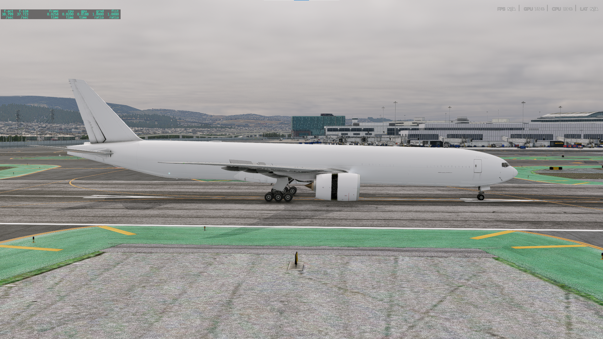

# Entry 5
##### 4/26/2025

## Content

I have done it I have finally completed my FP now all I have to do Is just go beyond it. For now, I only have a simple white plane with some animations that are also a little broken. For example, the landing door animation loops two times for some reason that is What I have to fix, but it at least still works perfectly fine. Flap speed I still have to work on it as it moves slowly. There are things that I did struggle with when having the plane load which was the engine thrust as it(the game) would give me an error saying **"I love when my users try to break the law of physics::: Error'You cant have engine thrust without adding a compressor. You can make these changes in X-Plane. Planemaker'"** This was frustrating to find the compressor component as it was just one number I did not think that since it was engine-related it would be in the engine section. But since it was only one line it was really hard to find and I looked everywhere to find it. I looked at videos and they found it but I did not I also looked at the documentation but still did not find anything to combat this I went to the engine specs section and looked at everything that was in front of me and also looked at every section and also subsection and I found it in the most sneaky spot I have ever seen the bottom left corner after doing that I was able to input it in and the plane loaded up fine. The only problem that I faced was the optimization of frames. For a plane that is just plain white with no major calculation in the background that is horrible, I might have to see what might be tanking the frames. The Aerodynamics I still have not managed to fix it yet I'm still troubleshooting it but hopefully, it will work by the time the Expo comes around.

So this is the final plane with a white livery and the beyond MVP will be to add an APCSA Livery and also fix the placements of the lights as they are not in their proper positions. Since there is no cockpit when you go into the cockpit view the image below shows you what you will see if you are in the cockpit view.

### [Engineering Design Process](https://hstatsep.github.io/students/#edp:~:text=most%20promising%20solution-,Create%20a%20prototype,-Test%20and%20evaluate)

Currently, I am in the 6th and 7th steps of the EDP which is to Test and evaluate the prototype and Improve as needed. As I am still in the testing phase I will still try to improve it.

### Skills
I Have not learned any new skills but I have improved on them improving on how to debug and also how to read as a learning planemaker took a lot of reading from the documentation.

[Previous](entry04.md) | [Next](entry06.md)

[Home](../README.md)