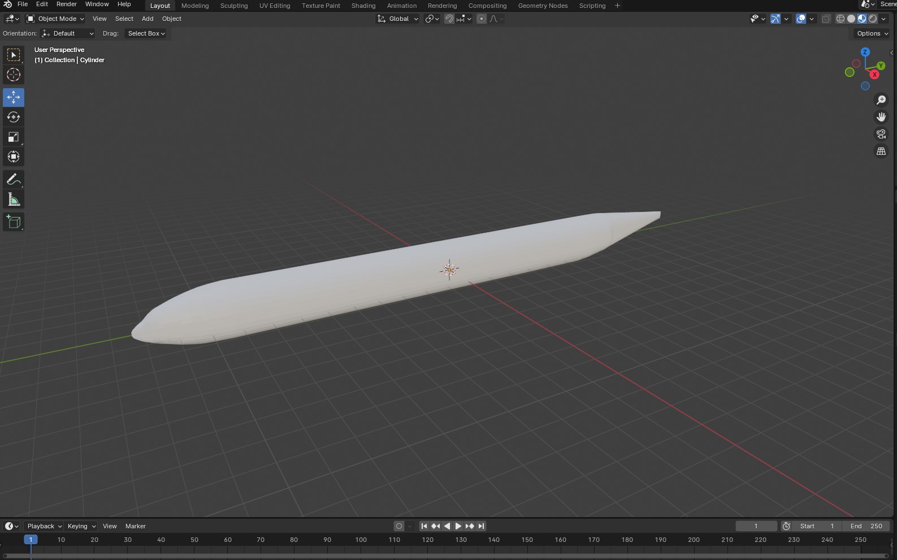
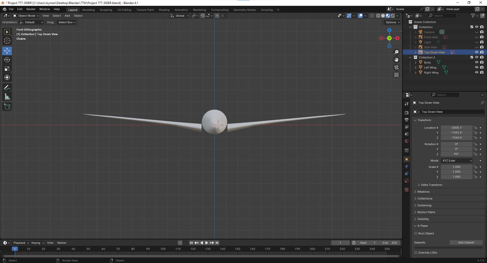
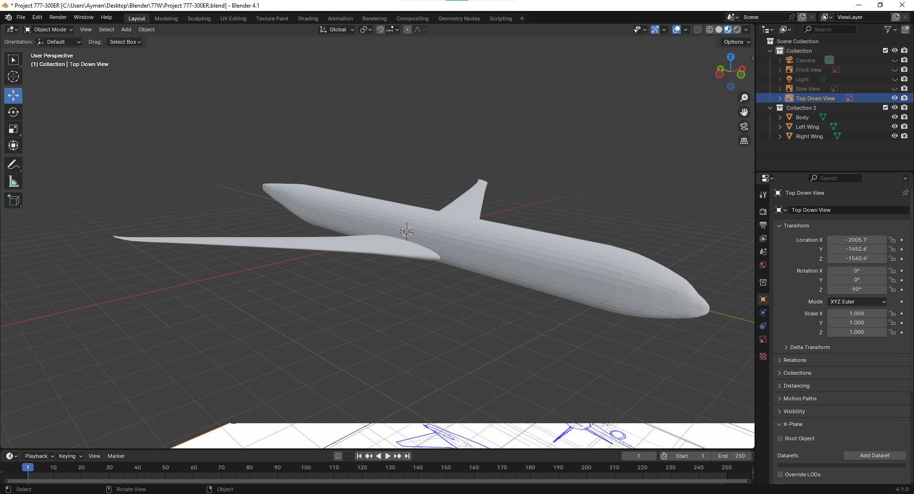

# Tool Learning Log

## Tool: **Blender**

## Project: **777-300ER**

LL1

### 10/20/2024:
* As of today I have made this:

This is the general shape of the fulesalage and I will soon update this to add the cockpit windows or to have the general shape of the wings but I will then Have to learn how to use the knife and mirriong feature.

LL4
### 11/24/2024: Modelling the wings
The wings are coming along very well. But they do need some improvement as they do not match the outline of the frame and there are a lot of jagged edges and they need to be smoothed out to make them look good. But this is what they look like. This week I learned how to use the mirror function that Blender has this helped me save time as I did not need to make 2 wings. All I did was make one wing, Duplicate it, and then flip it on the x-axis to make it match the outline. The wing took me 30 minutes to make and the mirroring function took me 2 min so I saved 28min.

 This week I learned how to use the mirror function that Blender has this really helped me save time as I did not need to make 2 wings. All I did was make one wing, Duplicate it, and then flip it on the x-axis to make it match the outline. The wing took me 30 minutes to make and the mirroring function took me 2 min so
 I saved 28min.

LL5
### 12/5/2024

This week I tried to use the knife tool but not successful As the more I tried using it blender would just crash for some apparent resson and was not able to do anything major this week other that do some tweaks to the fuelsallage.

<!--
* Links you used today (websites, videos, etc)
* Things you tried, progress you made, etc
* Challenges, a-ha moments, etc
* Questions you still have
* What you're going to try next
-->
